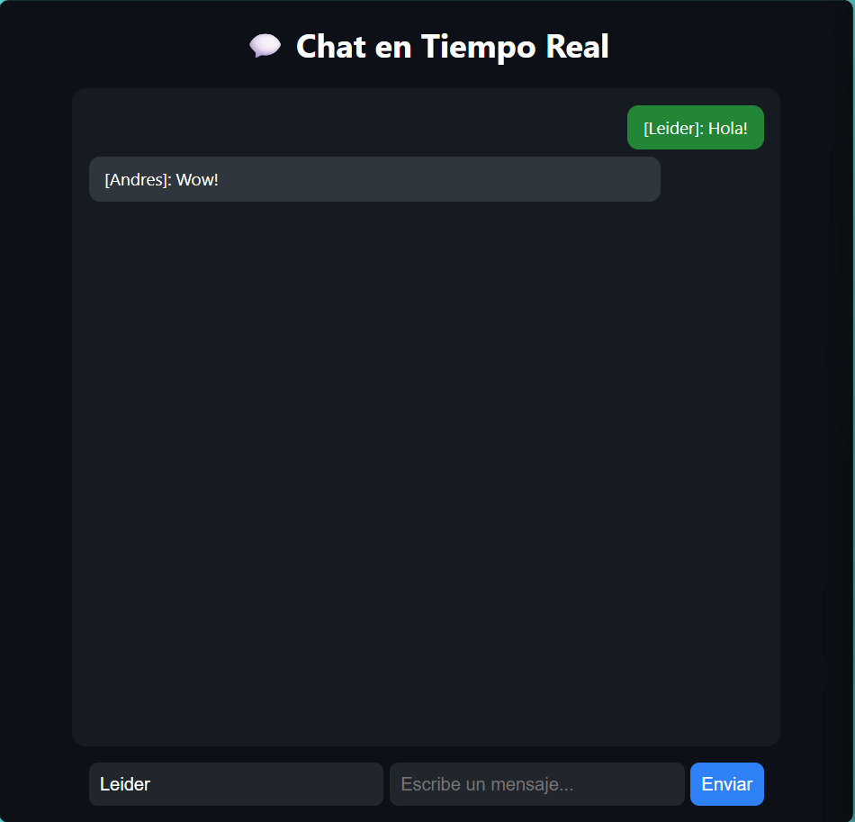
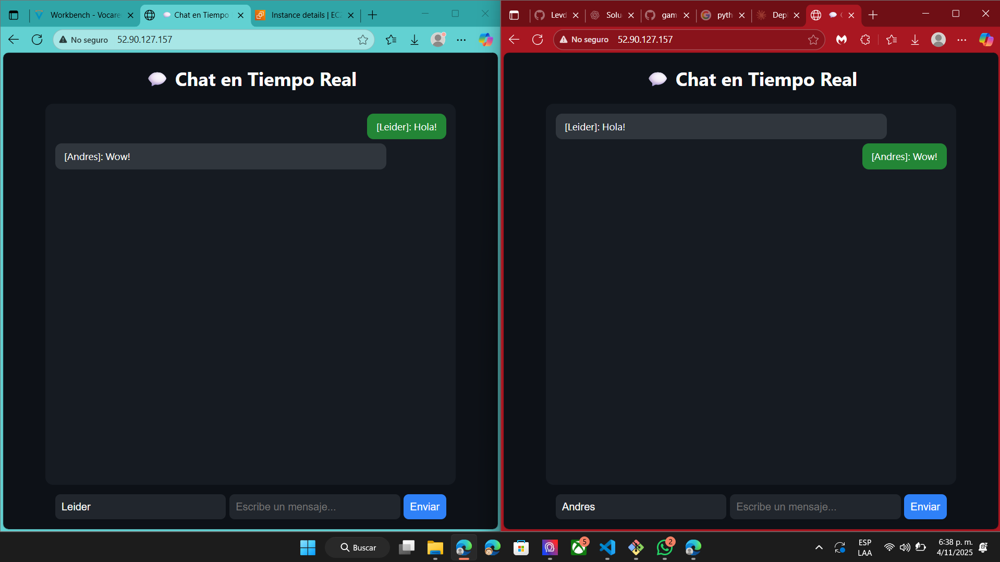

# 💬 Chat en Tiempo Real — Python + WebSockets + Docker + PostgreSQL

Una aplicación web de **chat en tiempo real**, construida con **Python (aiohttp)**, **WebSockets** y **PostgreSQL**, totalmente **contenedorizada con Docker** para fácil despliegue en **AWS EC2** o cualquier servidor Linux.

---

## 🚀 Características

- 💬 Comunicación en tiempo real entre múltiples usuarios.
- 🧩 Servidor backend en **Python (aiohttp + websockets)**.
- 🗄️ Almacenamiento de mensajes en **PostgreSQL**.
- 🐳 Totalmente contenerizada con **Docker y Docker Compose**.
- 🌐 Desplegable fácilmente en **AWS EC2** o cualquier VPS.
- 🎨 Interfaz simple y moderna (HTML + CSS + JS puro).

---

## 🧠 Cómo funciona

1. El servidor Python abre dos servicios:
   - Un servidor HTTP que entrega `index.html`.
   - Un servidor **WebSocket** en `/ws` para manejar mensajes en tiempo real.
2. Cuando un usuario envía un mensaje:
   - El cliente lo envía al servidor mediante WebSocket.
   - El servidor lo guarda en la base de datos PostgreSQL.
   - Luego retransmite el mensaje a **todos los clientes conectados**.
3. Todo esto ocurre sin recargar la página.

---

# 📂 Estructura del proyecto
```
chat-app/
├── server.py              # Servidor Python con aiohttp y WebSockets
├── index.html             # Interfaz del chat (frontend)
├── Dockerfile             # Imagen de la app Python
├── docker-compose.yml     # Orquestación de contenedores (app + DB)
└── README.md              # Documentación del proyecto
```

---

## ⚙️ Instalación y uso local

### 1️⃣ Clonar el repositorio
```bash
git clone https://github.com/tuusuario/chat-app.git
cd chat-app
```
###  2️⃣ Construir e iniciar los contenedores
```bash
docker compose up --build
```

###  3️⃣ Abrir en el navegador
http://localhost

- Si no funciona, usa el siguiente comando en una terminal python y dejala corriendo
```bash
python -m http.server 5500
```
- Luego, abre en tu navegador http://localhost:5500

# 🚀 Despliegue en AWS EC2

## Paso 1: Crear una instancia EC2 con Ubuntu

1. Accede a la consola de AWS EC2
2. Lanza una nueva instancia con Ubuntu Server (recomendado: Ubuntu 22.04 LTS)
3. Configura el grupo de seguridad para permitir:
   - Puerto 22 (SSH)
   - Puerto 80 (HTTP)
   - Puerto 8000 (TCP)

## Paso 2: Instalar Docker y Docker Compose

Conéctate a tu instancia EC2 por SSH y ejecuta:
```bash
sudo apt update
sudo apt install docker.io docker-compose -y
```

## Paso 3: Clonar los archivos del proyecto

```bash
git clone https://github.com/Levdev200/chat-app.git
cd chat-app
```

## Paso 4: Ejecutar la aplicación

Dentro del directorio del proyecto, ejecuta:
```bash
docker compose up --build -d
```

## Paso 5: Acceder a la aplicación

Abre tu navegador y visita:
```
http://<tu-ip-publica-ec2>
```

---

## 🖼️ Capturas del funcionamiento

### 📸 Imagen 1: Vista principal del chat


### 📸 Imagen 2: Envío de mensaje desde un usuario


### 📸 Imagen 3: Contenedores ejecutándose en AWS EC2


---

## 📝 Notas adicionales

- Asegúrate de que los puertos necesarios estén abiertos en el grupo de seguridad de AWS
- Para producción, considera usar un dominio y configurar HTTPS.
- Monitorea el uso de recursos de tu instancia EC2
